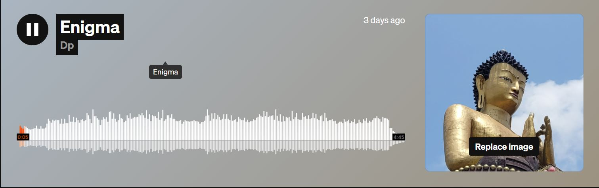
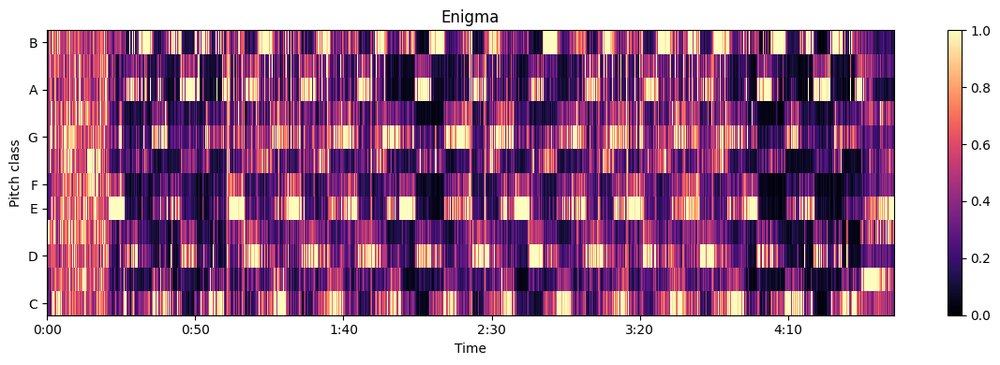

# musical-key-finder
A python project that uses Librosa and other libraries to analyze the key that a song (an .mp3) is in, i.e. F major or C# minor, using the Krumhansl-Schmuckler key-finding algorithm.

## Analytical tools
We will first analyze part of "Une Barque sur l'Ocean," a complex piece for solo piano by French composer Maurice Ravel. Click the below to be taken to Soundcloud and hear the .mp3 file:

[](https://soundcloud.com/jack-mcarthur-6407193/f-minor-segment-of-une-barque-sur-locean)

This piece has several sections with different keys, as we can learn by loading it using the Librosa library and passing it to an instance of the Tonal_Fragment class. We do this below, and output a chomagram, a chart indicating the intensity associated with each pitch class (C, C#, D, etc.) vs. time.
```python
audio_path = 'une-barque-sur-l\'ocean.mp3'
y, sr = librosa.load(audio_path)
y_harmonic, y_percussive = librosa.effects.hpss(y)

unebarque = Tonal_Fragment(y_harmonic, sr)
unebarque.chromagram("Une Barque sur l\'Ocean")
```


It is apparent that this clip has distinct sections, in which different pitch classes are most prominent; for example, the section from t=0 sec. to t=22 sec. uses the pitches C# and F# more than any other. We can determine how much each pitch class is used in that chunk with the following code:
```python
unebarque_fsharp_min = Tonal_Fragment(y_harmonic, sr, tend=22)
unebarque_fsharp_min.print_chroma()
```
```
C	1.000
C#	0.627
D	0.920
D#	0.652
E	0.956
F	0.618
F#	0.668
G	0.993
G#	0.670
A	0.835
A#	0.645
B	0.979
```
C is the most prominent (1.000), followed by G (0.993) and B (0.979).  We can determine the key of the section from t=0 sec. to t=22 sec. with the following code:
```python
unebarque_fsharp_maj = Tonal_Fragment(y_harmonic, sr, tend=22)
unebarque_fsharp_maj.print_key()
```
```
Detected key: E minor, correlation: 0.793
```
The key of the song is determined with the Krumhansl-Schmuckler key-finding algorithm, which  correlates the prominence of each pitch class in a sample with typical profiles of a major key and a minor key, and returns the key with the highest correlation coefficient. In this case, the returned key of F# minor is correct, even though F# is not the most prominent pitch in this sample. Many algorithms make the assumption that the most prominent pitch in the sample is the "tonic," or the root of the key; a strength of this algorithm is that it does not make this assumption.
The correlation coefficients of the chroma data can also be printed:
```python
unebarque_fsharp_min.corr_table()
```
```
A major	 0.174
A minor	 0.527
A# major	-0.254
A# minor	-0.739
B major	-0.061
B minor	 0.446
C major	 0.706
C minor	 0.249
C# major	-0.793
C# minor	-0.199
D major	 0.417
D minor	 0.104
D# major	-0.294
D# minor	-0.593
E major	 0.215
E minor	 0.793
F major	 0.080
F minor	-0.372
F# major	-0.596
F# minor	-0.237
G major	 0.860
G minor	 0.188
G# major	-0.455
G# minor	-0.166
```
This shows E minor as a clear second-best option, and allows for comparison between the goodness of fit of all keys.

This algorithm is not perfect, but it does offer warning when it gives a result with low confidence. This can be seen in the next section of the clip of "Une Barque sur l'Ocean," from t=22 sec. to t=33 sec., which is in E minor:
```python
unebarque_e_min = Tonal_Fragment(y_harmonic, sr, tstart=22, tend=33)
unebarque_e_min.print_key()
```
```
Detected key: D major, correlation: 0.638
also possible: A minor, correlation: 0.598
```
Other sound clips can also be analyzed, and two more examples are given in the Jupyter notebook [musicalkeyfinder.ipynb](musicalkeyfinder.ipynb) in this repository. The Tonal_Fragment class is also saved in the file [keyfinder.py](keyfinder.py). Analysis of .mp3 files does require FFMpeg to be installed, but .wav and other files can be analyzed by Librosa without it. Analyses are most accurate if the harmonic part of the sample is separated from the percussive part, and if a reasonable length of sound (10 seconds or more) is used.
